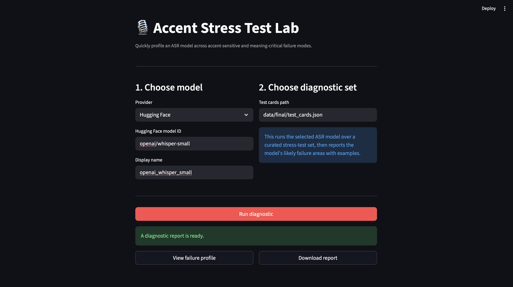
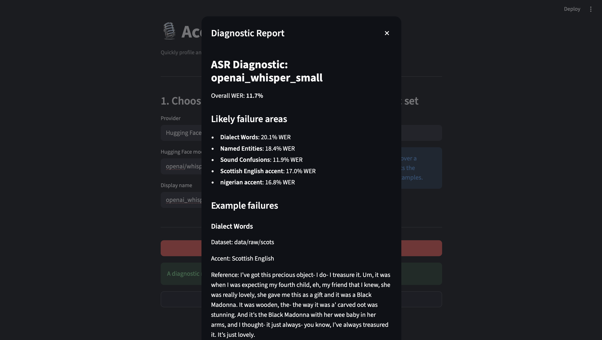

# Accent Stress Test Lab -v0.0.1

A small diagnostic tool for testing where ASR models struggle on accented speech.

## Why I built this

This project came out of my dissertation work on trustworthy ASR for high-stakes transcription.

While testing different speech recognition models, I kept running into the same problem: a model could have a decent overall WER, but still fail on things that really mattered.

For example, it might do okay generally, but struggle with:

* names
* numbers and dates
* negation
* accented pronunciations
* dialect words

So I built this as a quick way to ask:

> “If I use this ASR model, where is it likely to fail?”

## What it does

Accent Stress Test Lab runs an ASR model over a small curated stress-test set and produces a simple failure profile.

It tells you things like:

* overall WER
* which accent groups had the highest errors
* which failure categories the model struggled with most
* example failures showing the reference and the model prediction

The goal is not to replace large ASR benchmarks. It is meant to be a quick diagnostic check before trusting a model too much.

## Current version

This version supports:

* Hugging Face ASR models
* OpenAI transcription models
* a small Streamlit interface
* a curated test card format
* automatic diagnostic report generation

Current diagnostic categories:

* named entities
* numbers, dates, and amounts
* negations
* sound confusions
* dialect words

## Screenshots

### Tool interface



### Diagnostic report



## How to run

Install dependencies:

```bash
pip install -r requirements.txt
```

Run the app:

```bash
streamlit run app.py
```

Or run from the command line:

```bash
python scripts/run_asr.py \
  --provider hf \
  --model_id openai/whisper-small \
  --model_name whisper-small \
  --cards data/final/test_cards.json \
  --out results/predictions_hf_whisper_small.json
```

Then evaluate:

```bash
python scripts/evaluate.py \
  --preds results/predictions_hf_whisper_small.json \
  --refs data/final/test_cards.json \
  --out reports/diagnostic_hf_whisper_small.md
```

For OpenAI models, set your API key first:

```bash
export OPENAI_API_KEY="your-api-key"
```

Then run:

```bash
python scripts/run_asr.py \
  --provider openai \
  --model_id gpt-4o-mini-transcribe \
  --model_name gpt-4o-mini-transcribe \
  --cards data/final/test_cards.json \
  --out results/predictions_openai_gpt4o_mini_transcribe.json
```

## What I have built so far - v0.0.1

* Collected candidate examples from accented speech datasets.
* Built a simple card format for diagnostic ASR testing.
* Added category tagging for failure types.
* Added Hugging Face ASR support.
* Added OpenAI transcription model support.
* Built a runner script for generating model predictions.
* Built an evaluation script that compares predictions to references.
* Added a simple diagnostic report showing likely failure areas.
* Added a Streamlit UI for running the tool locally.

## What I want to improve next

* Add more accents and more balanced examples.
* Improve the test set quality.
* Add better meaning-level checks beyond WER.
* Let users upload their own audio/test cards.
* Add side-by-side model comparison.
* Improve the frontend and report design.
* Package the tool so it is easier for others to install and use.

## Why this matters

ASR models are often judged by one average score. But in real use, the important question is often more specific:

> “Will this model fail on the kinds of speech and details I care about?”

This project is my attempt to make that easier to check without having to look for benchmarks or leaderboards.
